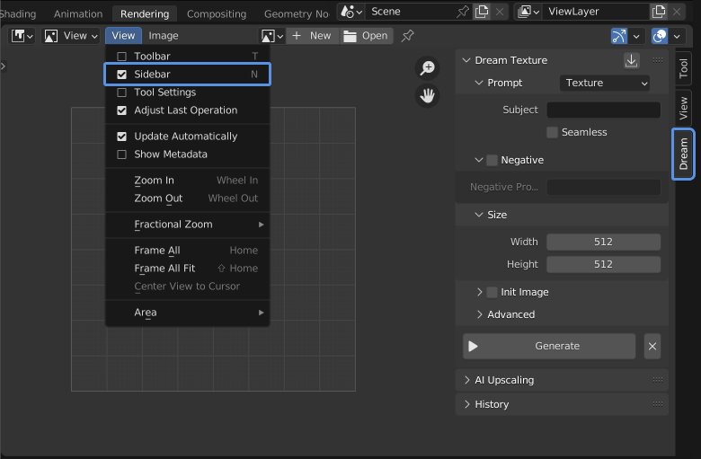

# Image Generation
1. To open Dream Textures, go to an Image Editor or Shader Editor
1. Ensure the sidebar is visible by pressing *N* or checking *View* > *Sidebar*
2. Select the *Dream* panel to open the interface

Enter a prompt then click *Generate*. It can take anywhere from a few seconds to a few minutes to generate, depending on your GPU.

## Options

### Pipeline
Two options are currently available:
* Stable Diffusion - for local generation
* DreamStudio - for cloud processing

Only the options available for the version you installed and the keys provided in the add-on preferences will be available.

### Model
Choose from any installed model. Some options require specific kinds of model.

For example, []

### Prompt

A few presets are available to help you create great prompts. They work by asking you to fill in a few simple fields, then generate a full prompt string that is passed to Stable Diffusion.

The default preset is *Texture*. It asks for a subject, and adds the word `texture` to the end. So if you enter `brick wall`, it will use the prompt `brick wall texture`.

### Seamless
Checking seamless will use a circular convolution to create a perfectly seamless image, which works great for textures.

You can also specify which axes should be seamless.

### Negative
Enabling negative prompts gives you finer control over your image. For example, if you asked for a `cloud city`, but you wanted to remove the buildings it added, you could enter the negative prompt `building`. This would tell Stable Diffusion to avoid drawing buildings. You can add as much content you want to the negative prompt, and it will avoid everything entered.

### Size
The target image dimensions. The width/height should be a multiple of 64, or it will round to the closest one for you.

Most graphics cards with 4+GB of VRAM should be able to generate 512x512 images. However, if you are getting CUDA memory errors, try decreasing the size.

> Stable Diffusion was trained on 512x512 images, so you will get the best results at this size (or at least when leaving one dimensions at 512).

### Source Image
Choose an image from a specific *File* or use the *Open Image*.

Three actions are available that work on a source image.

#### Modify
Mixes the image with the noise with the ratio specified by the *Noise Strength*. This will make Stable Diffusion match the style, composition, etc. from it.

Stength specifies how much latent noise to mix with the image. A higher strength means more latent noise, and more deviation from the init image. If you want it to stick to the image more, decrease the strength.

> Depending on the strength value, some steps will be skipped. For example, if you specified `10` steps and set strength to `0.5`, only `5` steps would be used.

Fit to width/height will ensure the image is contained within the configured size.

The *Image Type* option has a few options:
1. Color - Mixes the image with noise

> The following options require a depth model to be selected, such as `stabilityai/stable-diffusion-2-depth`. Follow the instructions to [download a model](setup.md#download-a-model).

2. Color and Generated Depth - Uses MiDaS to infer the depth of the initial image and includes it in the conditioning. Can give results that more closely match the composition of the source image.
3. Color and Depth Map - Specify a secondary image to use as the depth map, instead of generating one with MiDaS.
4. Depth - Treats the intial image as a depth map, and ignores any color. The generated image will match the composition but not colors of the original.

### Advanced
You can have more control over the generation by trying different values for these parameters:

* Random Seed - When enabled, a seed will be selected for you
    * Seed - The value used to seed RNG, if text is input instead of a number its hash will be used
* Steps - Number of sampler steps, higher steps will give the sampler more time to converge and clear up artifacts
* CFG Scale - How strongly the prompt influences the output
* Scheduler - Some schedulers take fewer steps to produce a good result than others. Try each one and see what you prefer.
* Step Preview - Whether to show each step in the image editor. Defaults to 'Fast', which samples the latents without using the VAE. 'Accurrate' will run the latents through the VAE at each step and slow down generation significantly.
* Speed Optimizations - Various optimizations to increase generation speed, some at the cost of VRAM. Recommended default is *Half Precision*.
* Memory Optimizations - Various optimizations to reduce VRAM consumption, some at the cost of speed. Recommended default is *Attention Slicing* with *Automatic* slice size.

### Iterations
How many images to generate. This is only particularly useful when *Random Seed* is enabled.